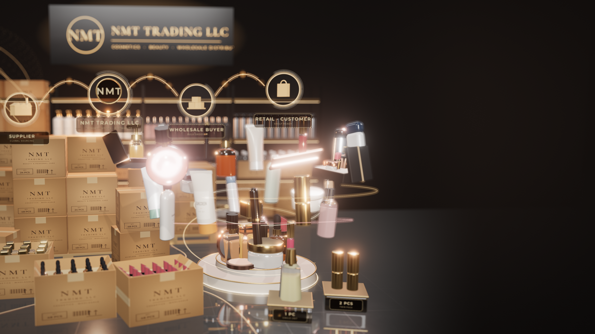

# NMT Trading LLC: 3D Commercial Visual

A premium, real-time **3D animated commercial** for **NMT Trading LLC**, a wholesale trader and distributor of cosmetics, beauty, skincare, haircare and personal-care products.

It is built as the **left side** of a larger ad layout. The 3D product showcase and the trading activity sit on the left. The right ~45% fades into clean studio negative space, left free for a headline, website, phone number and contact details.



## What's in the scene

| Area | Content |
| --- | --- |
| **Hero podium** (foreground) | Marble and gold two-tier podium with standing hero products: fragrance, vitamin-C serum, cream jar, foundation, lipstick, toner, compact, lip gloss. |
| **Floating orbit** | 24 products slowly rotate in two rings around the podium, with motion trails: capped lipstick, eyeshadow palette, mascara, serum, sunscreen, perfume, shampoo, blush, face wash, hair oil, makeup brush, body wash, moisturizer, eyeliner, deodorant spray, BB cream, conditioner, lip gloss, hair mask, hair spray, concealer, deodorant stick, toner, cosmetic gift set. |
| **Wholesale stock** | Pallets stacked with printed NMT Trading LLC cartons (48 / 24 / 96 PCS), a shrink-wrapped pallet, shipment cartons, and open cartons with divider grids full of bulk lipsticks, serums and perfumes. |
| **1 PC / 2 PCS** | Two acrylic plinths with gold tops show single-unit and twin-pack quantities next to the bulk cartons. |
| **Warehouse** | Graphite racking with warm LED strips. Rows of the same product sit in bulk (shampoo, body lotion, perfume, toner, shower gel, hair spray, cream jars), alongside carton storage. |
| **Branding** | Illuminated back-lit NMT Trading LLC logo panel, carton flexo print, and the NMT node on the trading network. It is kept corporate and understated. |
| **Supply-chain flow** | Holographic network: **Supplier → NMT Trading LLC → Wholesale Buyer → Retail / Customer**. Light pulses travel along the links, next to a dotted global-sourcing globe with route arcs and glowing dispatch lanes on the floor. |
| **VFX** | Cinematic key, rim and fill lighting. Soft shadows, glossy floor reflections, physically based glass and liquids (transmission), metals, pearlescent plastics. Holographic arcs, gold particles, bloom, depth of field, vignette and fine grain. |

All products are **procedural and unbranded**. Their shapes and materials follow real commercial packaging, but they carry only generic category labels such as "SERUM" or "SHAMPOO". There are no third-party logos or trademarks.

## Run it

It is a static site with no build step. Three.js and the fonts are vendored.

```bash
npx http-server .        # or: python3 -m http.server
# open http://localhost:8080
```

Controls (bottom-left): **Pause**, **Text-safe guide** (overlays a sample layout on the right negative space), **4K still** (downloads a 3840×2160 PNG of the current frame), **Record loop** (records the seamless 24 s loop to WebM).
Keys: `H` hide UI · `G` guide · `Space` pause.

URL options: `?q=low` for lighter hardware (no reflections or DOF), `?shot=hero` for a product close-up camera.

## Offline rendering (stills & video)

The animation is deterministic: every frame is a function of time, and the camera, particles and orbits all loop seamlessly every 24 s. You can render any frame at any resolution:

```bash
npm install playwright      # uses the bundled/installed Chromium
node scripts/render.mjs still  --w 3840 --h 2160 --t 4 --out renders/nmt-still-4k.png
node scripts/render.mjs still  --w 3840 --h 2160 --t 4 --shot hero --out renders/nmt-hero-4k.png
node scripts/render.mjs frames --w 3840 --h 2160 --fps 30 --dur 24 --out renders/frames
ffmpeg -framerate 30 -i renders/frames/%04d.png -c:v libx264 -pix_fmt yuv420p -crf 14 nmt-4k.mp4
```

Use a machine with a GPU for 4K video. Headless software rendering works, but it is slow.

## Composition notes

* The camera uses an off-centre projection (`setViewOffset`), so its optical centre sits at 34 % of the frame width (`FOCUS_X` in `src/main.js`). The showcase stays on the left however the camera moves.
* A final grade pass blends the right side into a soft warm-charcoal gradient. The copy area stays clean and even, and white or gold typography reads well on it.

## Files

```
index.html            page, import map, UI
src/main.js           scene, lighting, warehouse, flow network, VFX, camera, post-processing
src/products.js       procedural cosmetic & personal-care product models + materials
src/textures.js       canvas textures: labels, carton print, logo panel, tags
scripts/render.mjs    headless still / frame renderer
vendor/three/         three.js r186 (MIT)
assets/fonts/         Cormorant Garamond, Montserrat (SIL OFL)
renders/              rendered stills / video
```
